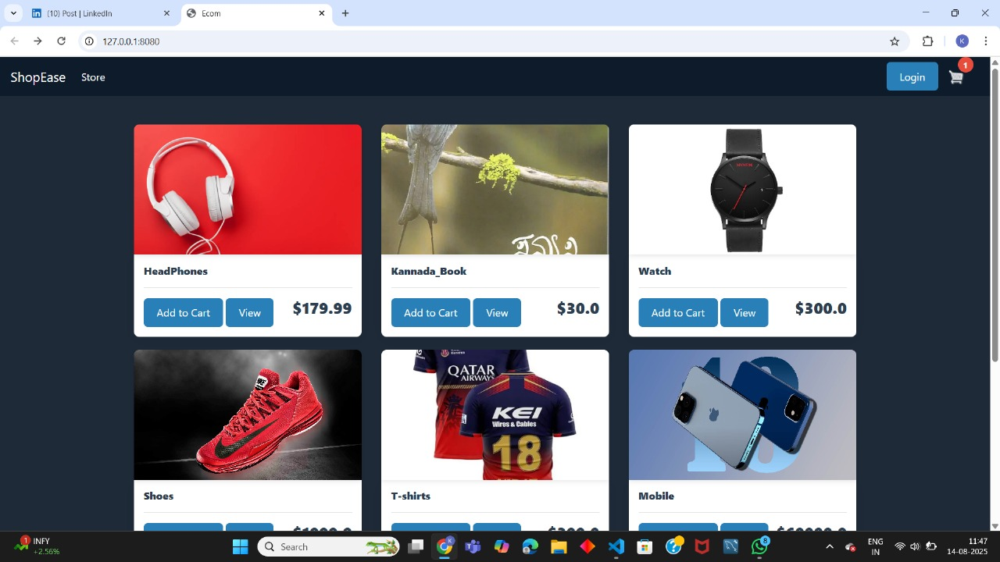
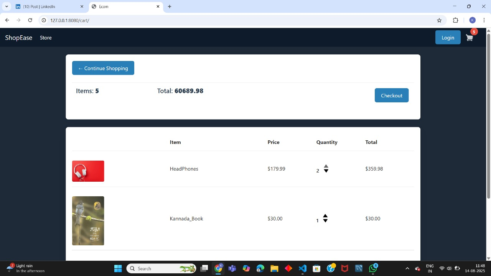
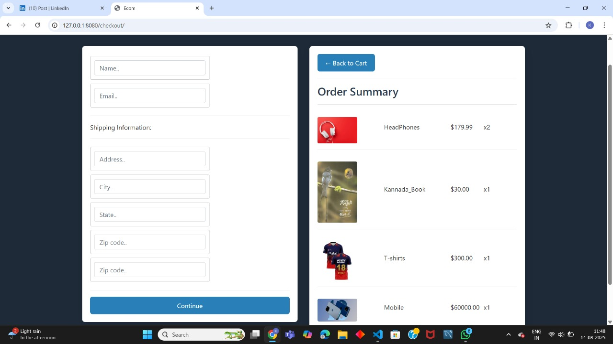
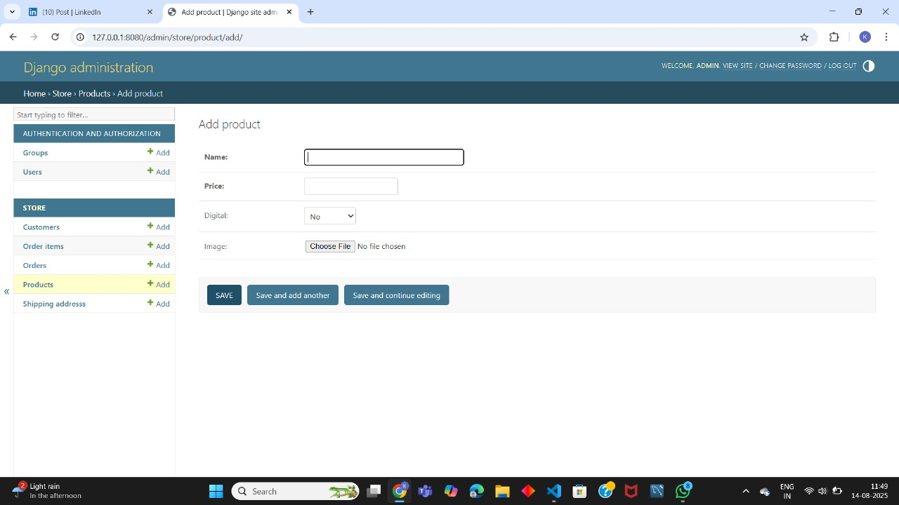
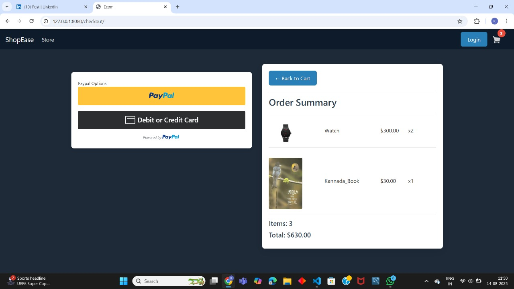

# 🛍️ ShopEase – E-commerce Web Application

ShopEase is a full-featured e-commerce web application built using **Python and Django**. It includes product listing, user authentication, cart management, and order processing. The project follows the Django MVT architecture and integrates CI/CD using GitHub Actions.

---

## 🔧 Features

- 🧾 User registration and login
- 🛍️ Product listing and detail view
- 🛒 Add to cart / remove from cart
- ✅ Order checkout functionality
- 🛠️ Django Admin panel for product management
- 🚀 CI/CD integration using GitHub Actions
- 📱 Fully responsive UI (HTML, CSS, JavaScript)

---

## 🛠 Tech Stack

| Layer       | Technologies                          |
|-------------|----------------------------------------|
| **Backend** | Python, Django                         |
| **Frontend**| HTML, CSS, JavaScript                  |
<<<<<<< HEAD
| **Database**| SQLite |
| **CI/CD**   | GitHub Actions                         |
| **Tools**   | Git, GitHub      |
=======
| **Database**| SQLite  |
| **CI/CD**   | GitHub Actions                         |
| **Tools**   | Git, GitHub,        |


---

### Homepage


### Cart Page


### Checkout Page


### Admin Panel Page


### Payment Page


## 🚀 How to Run Locally

```bash
# Clone the repository
git clone https://github.com/yourusername/shopease-django.git
cd shopease-django

# Create virtual environment
python -m venv venv
# Activate it
# Windows:
venv\Scripts\activate
# macOS/Linux:
source venv/bin/activate

# Install dependencies
pip install -r requirements.txt

# Run migrations
python manage.py makemigrations
python manage.py migrate

# Start development server
python manage.py runserver
